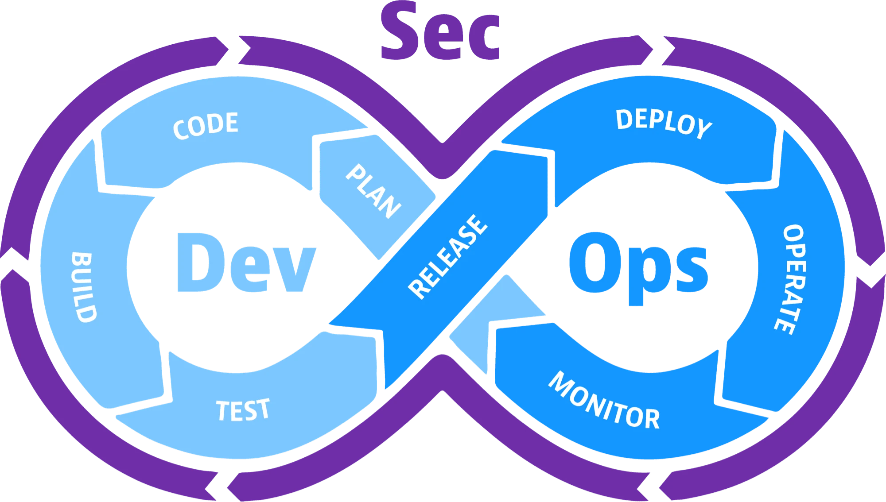

---
tags:
  - DevSecOps
  - Skills
  - Comparison
---

# 🆕 Introduction to DevSecOps

Best security practices are automated and go straight inside the DevOps workflow.

# DevSecOps Engineer vs Security Engineer 

- **Security Engineer:** Focuses on securing systems, networks and infrastructure.

- **DevSecOps Engineer:** Integrates security on the entire DevOps, is the connection between Dev, Ops and Security team. It also helps Devs and Security Engineers to discover and fix issues.

# Skills

- Bridge between teams.
- Creates processes to help ensure security.
- Teaches and shares knewledge.