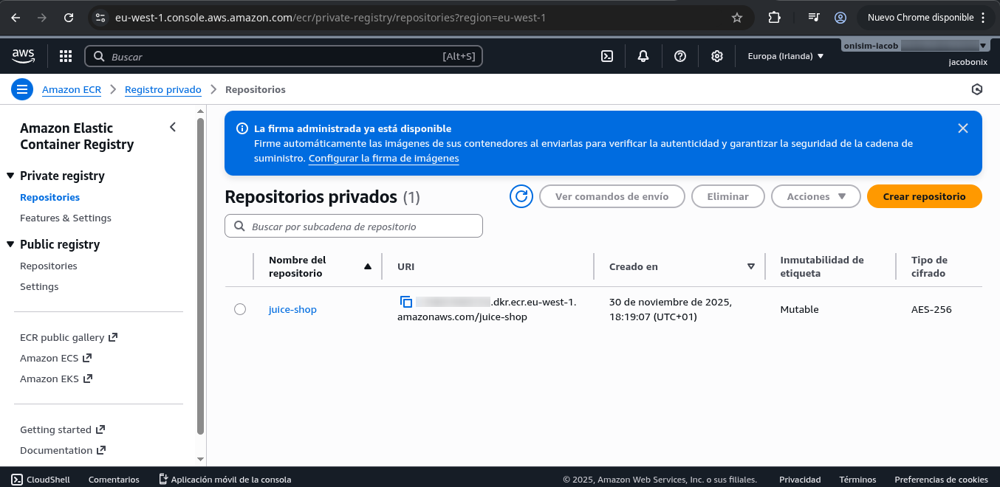
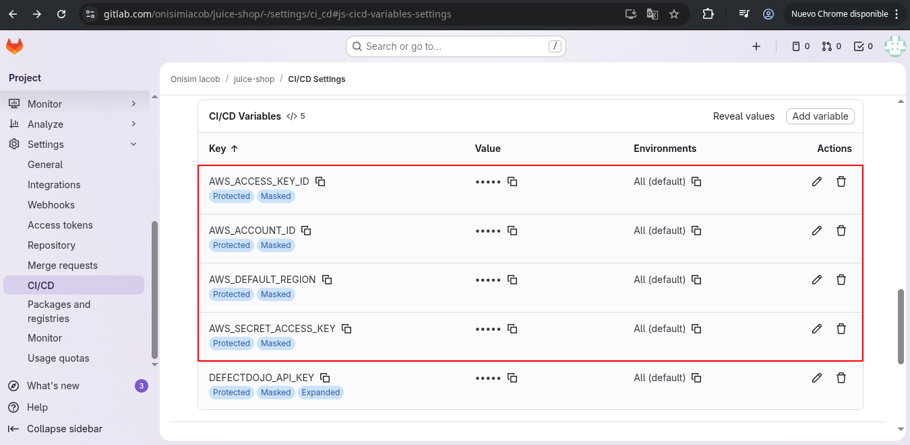
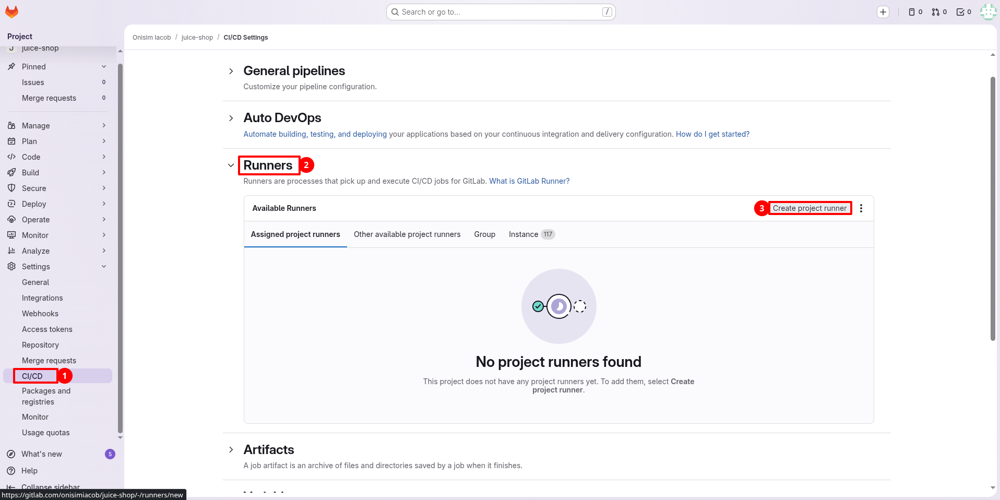
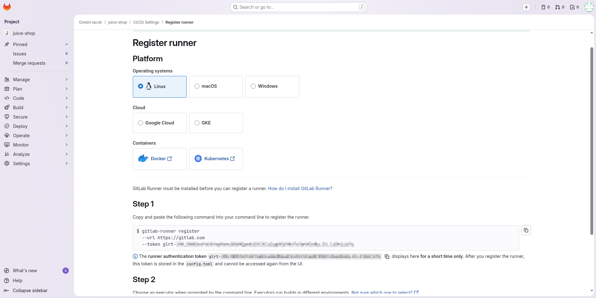
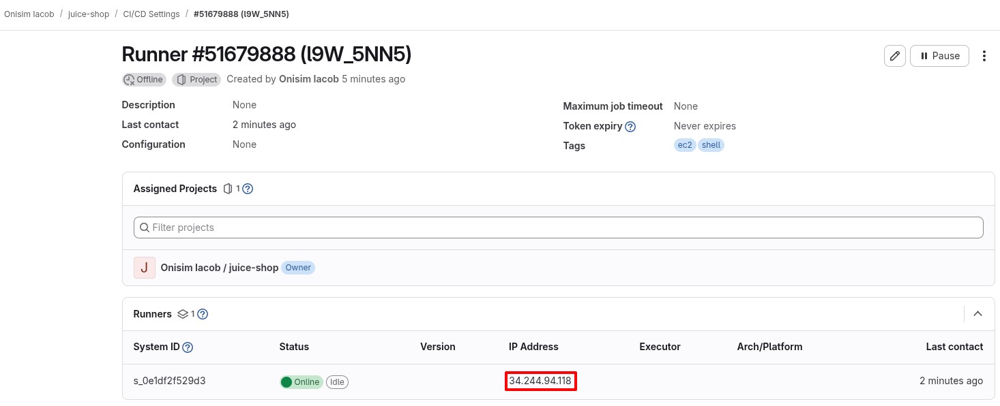
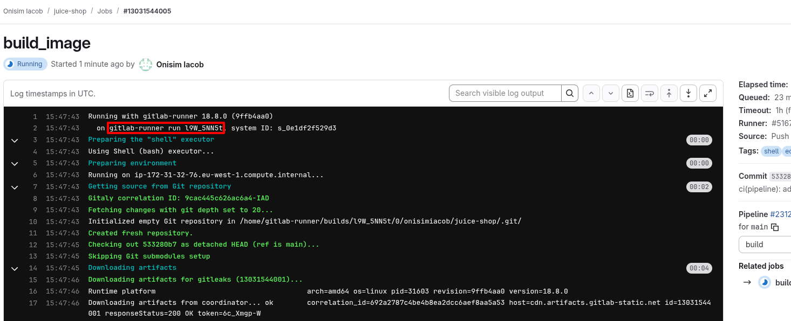
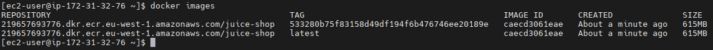

# 🏗️ Build a CD Pipeline

## Introduction

The first step is creating an AWS Account (I already have one due to the DevOps Bootcamp). 

## AWS Pre-requisites

- After logged in the AWS account, we first need to crete a Amazon Elastic Registry.



- After that, we will create some Access Keys. Nana shows how we can create AWS Access Keys on root account which is a critical.


- Add these **Access Keys** just like the rest of the variables inside the Juice Shop repository, aswell as the **Region** and the **Account ID**.



- We can add this to our CICD pipeline we need to tweak the Build stage.

```yaml
# Build the docker image
build_image:
  stage: build
  image: docker:24
  services:
    - docker:24-dind
  before_script:
    - apk add --no-cache aws-cli
    - aws ecr get-login-password --region "$AWS_DEFAULT_REGION" \
        | docker login --username AWS --password-stdin "$AWS_ACCOUNT_ID.dkr.ecr.$AWS_DEFAULT_REGION.amazonaws.com"
  script:
    - docker build -t "$IMAGE_NAME:$CI_COMMIT_SHA" -t "$IMAGE_NAME:latest" .
    - docker push "$IMAGE_NAME:$CI_COMMIT_SHA"
    - docker push "$IMAGE_NAME:latest"
```

## Complete CICD Pipeline

Follow this guide to create a EC2 instance: [https://docs.aws.amazon.com/AWSEC2/latest/UserGuide/EC2_GetStarted.html
](https://docs.aws.amazon.com/AWSEC2/latest/UserGuide/EC2_GetStarted.html)

!!! note

    The creation of the EC2 Instance is a topic that has already been descussed on the previous DevOps bootcamp. 

- After having the EC2 instance, create a variable on the `Git Repository / Settings / CI/CD` with the Private SSH Key named `SSH_PRIVATE_KEY`. 

- This is the complete CICD pipeline:

```yaml
stages: 
  - cache
  - test
  - build
  - deploy

# Improve build times with a cache task that saves the dependencies as an artifact
create_cache:
  image: node:18-bullseye
  stage: cache
  script:
    - yarn install --ignore-engines 
  cache:
    key:
      files:
        - yarn.lock
    paths:
      - node_modules
      - yarn.lock
      - .yarn
    policy: pull-push

# Test using the cache to speedup testing
yarn_test:
  image: node:18-bullseye
  stage: test
  script:
    - yarn install --ignore-engines # fix The engine "node" is incompatible with this module. Expected version "20 || >=22". Got "18.20.8"
    - yarn test
  cache:
    key:
      files:
        - yarn.lock
    paths:
      - node_modules
      - yarn.lock
      - .yarn
    policy: pull

# Scan for Git Leaked credentials
gitleaks:
  stage: test
  image:
    name: zricethezav/gitleaks:latest
    entrypoint: [""]
  script:
    - gitleaks detect --verbose --source . -f json -r gitleaks.json
  allow_failure: true
  artifacts:
    when: always
    paths:
      - gitleaks.json

# Scan for NodeJS SAST vulnerabilies
njsscan:
  stage: test
  image: python:3.13
  before_script:
    - pip3 install --upgrade njsscan
  script:
    - njsscan --exit-warning . --sarif -o njsscan.sarif
  allow_failure: true
  artifacts:
    when: always
    paths:
      - njsscan.sarif

# Scan with SemGrep
semgrep:
  stage: test
  image: semgrep/semgrep
  variables:
    SEMGREP_RULES: p/javascript
  script:
    - semgrep ci --json --output semgrep.json
  allow_failure: true
  artifacts:
    when: always
    paths:
      - semgrep.json

retire:
  stage: test
  image: node:18-bullseye
  cache:
    key:
      files:
        - yarn.lock
    paths:
      - node_modules
      - yarn.lock
      - .yarn
    policy: pull
  before_script:
    - npm install -g retire
  script:
    - retire --path . --outputformat json --outputpath retire.json
  allow_failure: true
  artifacts:
    when: always
    paths:
      - retire.json

# Upload results to DefectDojo
upload_reports:
  stage: test
  image: python
  needs: ["gitleaks", "njsscan", "semgrep", "retire"]
  when: always
  variables:
    DEFECTDOJO_API_KEY: $DEFECTDOJO_API_KEY
  before_script:
    - pip3 install requests
  script:
    - python3 upload-reports.py gitleaks.json
    - python3 upload-reports.py njsscan.sarif
    - python3 upload-reports.py semgrep.json
    - python3 upload-reports.py retire.json

# Build the docker image
build_image:
  stage: build
  image: docker:24
  variables:
    IMAGE_NAME: $AWS_ACCOUNT_ID.dkr.ecr.$AWS_DEFAULT_REGION.amazonaws.com/juice-shop
  services:
    - docker:24-dind
  before_script:
    - apk add --no-cache aws-cli
    - aws ecr get-login-password --region $AWS_DEFAULT_REGION |
      docker login --username AWS --password-stdin ${AWS_ACCOUNT_ID}.dkr.ecr.${AWS_DEFAULT_REGION}.amazonaws.com

  script:
    - docker build -t "$IMAGE_NAME:$CI_COMMIT_SHA" -t "$IMAGE_NAME:latest" .
    - docker push "$IMAGE_NAME:$CI_COMMIT_SHA"
    - docker push "$IMAGE_NAME:latest"

# Deploy the container to the EC2 instance through SSH (not for production workloads)
deploy_image:
  stage: deploy
  image: debian:bullseye-slim
  before_script:
    - apt update -y && apt install openssh-client -y
    - eval $(ssh-agent -s)
    - chmod 400 "$SSH_PRIVATE_KEY"
    - ssh-add "$SSH_PRIVATE_KEY"
    - mkdir -p ~/.ssh
    - chmod 700 ~/.ssh
  script:
    - ssh -o StrictHostKeyChecking=no $SERVER_USER@$SERVER_IP "docker pull $IMAGE_NAME:latest"
    - ssh -o StrictHostKeyChecking=no $SERVER_USER@$SERVER_IP "docker stop juice-shop || true && docker rm juice-shop || true"
    - ssh -o StrictHostKeyChecking=no $SERVER_USER@$SERVER_IP "docker run -d --name juice-shop -p 3000:3000 $IMAGE_NAME:latest"
```

## Self-Managed Gitlab Runners

- Follow [Gitlab Runner Install Guide Amazon Linux](https://docs.gitlab.com/runner/install/linux-repository/?tab=RHEL%2FCentOS%2FFedora%2FAmazon+Linux#install-gitlab-runner) and how to install [Docker Install Guide Amazon Linux](https://docs.aws.amazon.com/es_es/serverless-application-model/latest/developerguide/install-docker.html).
  
- Head to Gitlab Runners and click `Create project runner`.



- Set a Name and set it up only for this project.


- Copy the command with the token.



- For this we used a `Amazon Linux` with `t3.large` as instance, `30GB of gp3` disk and `ssh 22 port open`. These are the commands executed on the server:

```bash
# update package repos
sudo yum update

# Download script gitLab runner
curl -L "https://packages.gitlab.com/install/repositories/runner/gitlab-runner/script.rpm.sh" -o script.rpm.sh

# Install gitlab runner on Amazon Linux
sudo bash script.rpm.sh

# Now update to the latest version
sudo yum update
sudo yum install gitlab-runner

# Install docker on Amazon Linux
sudo yum install -y docker

# Start Docker Service
sudo service docker start

# Add gitlab-runner & ec2 users to docker group
sudo usermod -aG docker gitlab-runner
sudo usermod -aG docker ec2-user

# Register runner
sudo gitlab-runner register \
--url "https://gitlab.com/" \
--token "glrt-XXXXX" \
--executor "shell"

# Start runner
gitlab-runner run
```

- This is the validation of the runner being online.



- Using the Self-Hosted Runner requires to remove the "docker-in-docker" image from the pipeline



- Validate docker build on the runner via ssh.


